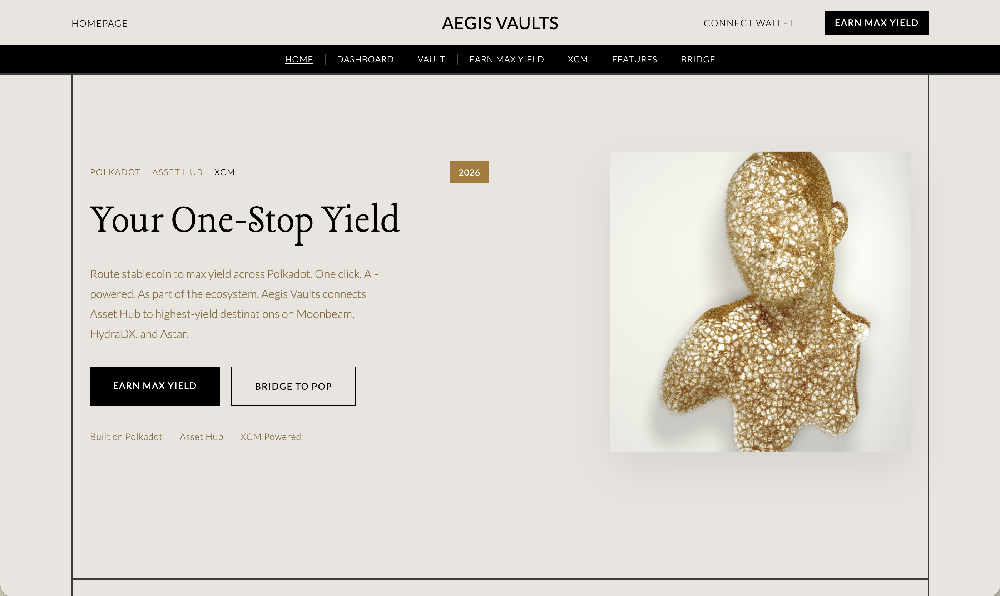

# Aegis Vaults

**Self-driving money on Polkadot.** Intent-based yield optimizer + self-managing stablecoin vault for the Polkadot Asset Hub.

Built for the OpenGuild × Web3 Foundation Hackathon (Stablecoin track). Reduces **~12 Clicks to Yield** and activates **$450M+ fragmented TVL** by combining Revive/PVM vaults, an AI Guardian (risk/rebalance), and an AI Oracle that routes liquidity via XCM to the highest safe yield.

---




---

## Who Are Our Users & What Do They Get?

| User | Who They Are | What Aegis Vaults Does for Them |
|------|--------------|----------------------------------|
| **Yield-seeking DeFi users** | Holders of DOT, USDC, or stablecoins on Polkadot who want yield without manual bridging. | One-click routing to best APY across HydraDX, Moonbeam, Astar; no gas-token juggling. |
| **Stablecoin minters** | Users who want to borrow against DOT collateral (e.g. mint pUSD). | Simple deposit → mint flow; health monitoring; AI Guardian protects at-risk positions. |
| **Liquidity providers / protocols** | Protocols or DAOs with idle TVL on Asset Hub. | Automated yield optimization; XCM execution without infra. |
| **Ecosystem builders** | Projects integrating yield or vaults into their UIs. | Reliable vault + oracle + XCM tooling; configurable guardians. |

**What they get:** Before → After. **Before:** ~12 clicks, manual bridging, gas hell. **After:** One click, AI routes to best yield, AI Guardian rebalances.

---

## How to Use the Site

| Page | What You Can Do |
|------|-----------------|
| **Home** | See top yield destinations; click through to Earn Max Yield. |
| **Dashboard** | View your balance, optimized yield, and current yield (connect wallet). |
| **Vault** | Deposit DOT → mint stablecoin debt; repay/withdraw (full vault); guardian flashRepay. |
| **Earn Max Yield** | One-click XCM link to best destination; route to DeFi app. |
| **XCM Builder** | Configure destination, amount, recipient; copy CLI or **Execute XCM** in-browser (Polkadot extension). |
| **Features** | AI Oracle, One-Click Route, AI Guardian overview. |
| **Bridge** | Link to Polkadot.js Apps for XCM and cross-chain transfers. |

**Requirements:** MetaMask (EVM) for vault; Polkadot extension (Talisman, Polkadot.js) for in-browser XCM.

**Users & keys:** Real users connect their own wallets (MetaMask, Polkadot extension). No private keys in the app. `PRIVATE_KEY` in `packages/contracts` is only for deployers when running deploy scripts—never committed, never in the frontend.

---

## Quick Start (Local)

1. **Frontend:** `cd packages/frontend && npm i && npm run dev` — runs at `http://localhost:5173`
2. **Contracts:** `cd packages/contracts && npm i && npm test` — deploy: `npm run deploy:testnet` (set `PRIVATE_KEY`, `GUARDIAN_ADDRESS`)
3. **Config:** Copy `packages/frontend/.env.example` to `.env`; set `VITE_VAULT_ADDRESS`, `VITE_VAULT_TYPE`, `VITE_RPC_URL`, `VITE_CHAIN_ID`

See [docs/contracts.md](docs/contracts.md) for deploy details.

---

## Repo Layout

```
aegis-vaults/
├── packages/
│   ├── contracts/     # Solidity vault (AegisVault, AegisVaultDemo) + deploy
│   ├── frontend/      # React + Vite UI
│   └── xcm-scripts/   # XCM transfer (ReserveTransferAssets) from Asset Hub
├── chopsticks/        # Local XCM fork (Asset Hub)
├── agent/             # AI Oracle, vault monitor, flashRepay
└── docs/              # contracts.md, async-backing.md
```

---

## Security

- **Non-custodial:** You retain control. MetaMask/Polkadot extension sign transactions; no keys in the app.
- **Contract:** Reentrancy guard, 150% health factor, user-only withdrawals. Guardian can flashRepay for at-risk positions.
- **Site:** No private keys; security headers on Vercel. See [docs/SECURITY.md](docs/SECURITY.md).

---

## Links

- [docs/contracts.md](docs/contracts.md) — ABIs, addresses, guardian
- [docs/SECURITY.md](docs/SECURITY.md) — Security overview
- Polkadot Asset Hub, Revive, Paseo testnet — see official Polkadot docs
